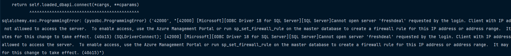
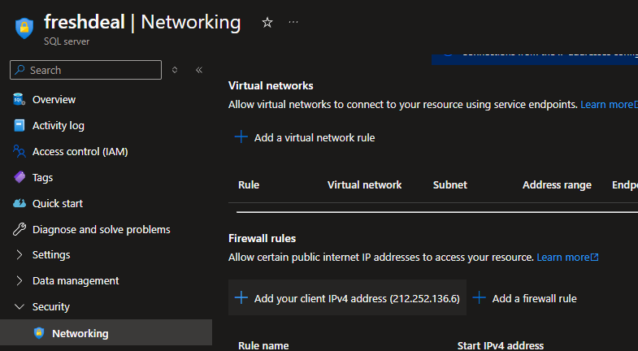

## AZURE SQL DATABASE  BLOCKS IP

```aiignore
sqlalchemy.exc.ProgrammingError: (pyodbc.ProgrammingError) ('42000', "[42000] [Microsoft][ODBC Driver 18 for SQL Server][SQL Server]Cannot open server 'freshdeal' requested by the login. Client with IP address...
```
   - go to FreshDeal (SQL server) on Azure 
   - click on security -> Networking -> add your client ipv4 address

   

---


   